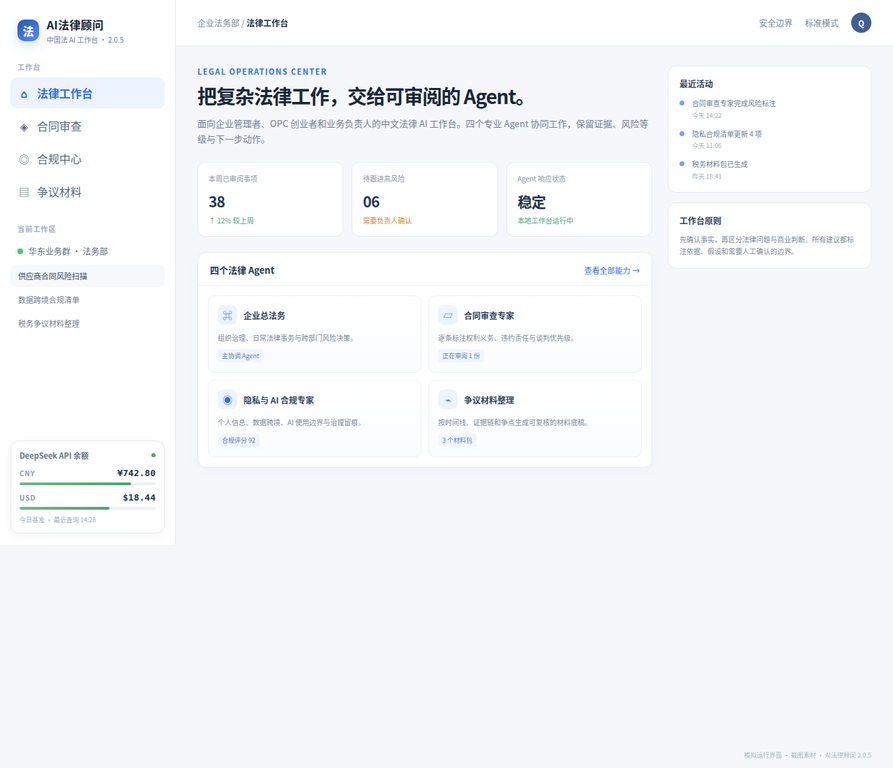
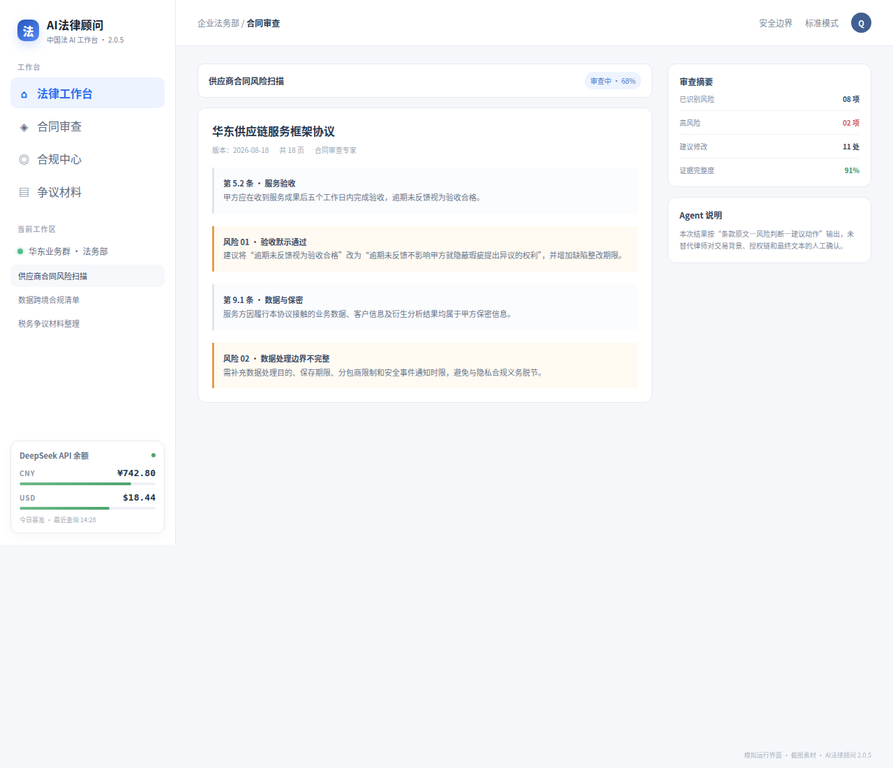
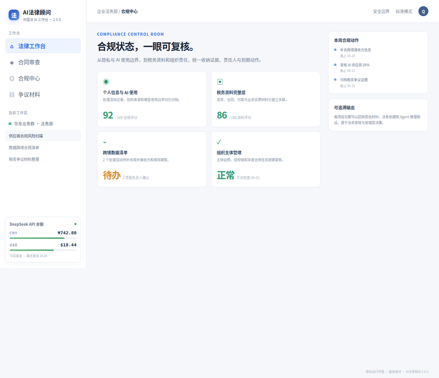

<div align="center">

# AI法律顾问

### 给企业高管、OPC 创业者和业务负责人的中文法律 AI 工作台

**不用装 Node.js，不用配置 Python，不用研究命令行。下载、安装、启动，即可开始整理合同、识别风险、梳理争议材料。**

<p>
  <a href="https://github.com/tyche66/AI-Legal-Advisor/actions/workflows/ci.yml"><strong>下载 2.0.8 Windows x64 安装程序</strong></a>
  ·
  <a href="https://github.com/tyche66/AI-Legal-Advisor/actions/workflows/ci.yml">查看 2.0.8 构建记录</a>
  ·
  <a href="docs/user-guide.md">阅读用户指南</a>
</p>

<p>
  
  
  
  
  
</p>

## 界面预览

下面的产品图来自仓库中的 [`assets/readme/ai-legal-advisor-preview.html`](assets/readme/ai-legal-advisor-preview.html)。它使用 HTML/CSS 模拟应用运行时，再由浏览器渲染截取，展示 AI法律顾问 2.0.8 的法律工作台、合同审查和合规中心。左侧底部的 **DeepSeek API 余额** 卡片即为本版本预置的 DSH-money-view 能力入口。

<p align="center">
  
  
  
</p>

</div>

> **AI法律顾问不是律师，也不替代律师意见。** 它用于信息整理、风险提示、合同审阅辅助和争议材料结构化；涉及重大交易、诉讼仲裁、监管申报或其他高风险事项时，请让具备相应资质的律师进行最终审查。

## 你可以用它做什么

AI法律顾问把复杂的法律工作拆成更容易上手的步骤：先明确事实和目标，再识别风险、列出依据、形成待办，最后交给专业人士复核。它特别适合没有专职法务、但每天都要面对合同、员工、供应商、客户、数据和争议问题的企业团队。

| 工作场景 | 适合的使用方式 |
| --- | --- |
| 合同签署前 | 提取关键义务、付款节点、违约责任、自动续期、单方变更和退出机制，形成风险清单与谈判建议。 |
| 企业日常经营 | 从企业总法务视角统筹用工、采购、销售、知识产权、公司治理和供应商管理问题。 |
| 数据与 AI 项目 | 梳理个人信息、数据处理、模型使用、第三方服务和跨境传输相关的合规事项。 |
| 争议发生后 | 将聊天记录、合同、邮件、付款凭证和时间线整理成结构化材料，帮助团队快速看清事实和证据缺口。 |
| 税务与经营安排 | 协助建立问题清单、比较可行路径并提示需要向税务和法律专业人士核验的关键点。 |

## 四个预置专家 Agent

安装后即可直接选择预置专家，不需要自己编写复杂指令。**企业总法务**默认作为入口，其他专家分别处理高频法律工作。

| 专家 | 主要职责 | 典型问题 |
| --- | --- | --- |
| **企业总法务** | 站在企业经营视角统筹法律风险、业务目标和执行优先级。 | “这个合作方案最大的法律风险是什么？我应该先补哪三项？” |
| **合同审查专家** | 逐条识别合同风险，区分红线、重要风险和可接受事项，并输出修改方向。 | “请把这份采购合同审成管理层能看懂的风险表。” |
| **隐私与 AI 合规专家** | 梳理个人信息、数据、算法、模型和第三方工具使用中的合规边界。 | “我们把客户资料交给 AI 工具前，需要做哪些准备？” |
| **争议材料整理** | 组织事实、时间线、证据目录、争议焦点和待核实事项。 | “把这些聊天记录和付款凭证整理成案件材料框架。” |

## Windows 开箱即用

2.0.8 在 2.0.6 的 Windows x64 开箱即用体验基础上，继续保留预置的 DeepSeek API 余额卡片和上一版本的稳定性修复，并新增合同事实账本、文件读取失败阻断、真实条款引用门禁、SaaS/DPA 专项路由和固定回归测试。双击安装包后按向导完成安装，桌面会生成“AI法律顾问”快捷方式；再次双击快捷方式，应用会显示启动状态并自动打开浏览器工作台。普通用户不需要额外安装 Node.js、Python、Git 或其他开发环境。请从下方 **2.0.8 CI artifact** 下载当前版本；下载后先解压 artifact，再运行其中的 `AI法律顾问-2.0.8-x64-Setup.exe`。如果电脑上仍运行旧版 AI法律顾问，请先退出旧程序，必要时卸载旧版后再安装，以避免旧进程或文件锁阻止 NSIS 覆盖文件。

### 下载与校验

| 项目 | 信息 |
| --- | --- |
| 当前版本 Windows x64 artifact | [下载 AI法律顾问 2.0.8 Windows installer](https://github.com/tyche66/AI-Legal-Advisor/actions/workflows/ci.yml) |
| 安装器文件名 | `AI法律顾问-2.0.8-x64-Setup.exe` |
| 构建记录 | [GitHub Actions CI 工作流](https://github.com/tyche66/AI-Legal-Advisor/actions/workflows/ci.yml) |
| 对应提交 | 本次 2.0.8 修复提交（以 GitHub 推送后的提交为准） |
| 上一稳定版安装包 | [AI法律顾问-2.0.4-x64-Setup.exe](https://files.manuscdn.com/user_upload_by_module/session_file/310519663749217922/PTixJaHngoCaRVwG.exe) |

下载并解压 artifact 后，可以在 Windows PowerShell 中使用下面的命令校验 2.0.8 安装文件：

```powershell
Get-FileHash .\AI法律顾问-2.0.8-x64-Setup.exe -Algorithm SHA256
```

首次启动时，应用会启动本机服务并在服务就绪后打开浏览器。若浏览器刚打开时仍在加载，请等待启动状态窗口完成；应用会对本机服务进行重试探测，不需要手动运行命令。

## 2.0.8 更新内容

2.0.8 延续 2.0.6 面向实际企业法律工作的强化基础，并把 [DSH-money-view](https://github.com/tyche66/DSH-money-view) 预置为 AI法律顾问的内置余额能力。用户不需要额外安装插件；当 Harness 中最近发生过 DeepSeek 调用时，工作台会在侧栏底部展示 CNY/USD 余额、当日基准、剩余进度和最近查询时间。

余额查询由 Host 侧完成，API Key 只通过 Harness credentials 服务解析，不进入浏览器端；查询遵循 DeepSeek API 的缓存提示，没有缓存提示时使用默认间隔，并在每日首次查询时建立基准。未配置 API Key 或近期没有 DeepSeek 调用时，卡片会显示相应的低打扰状态，不会持续轮询余额接口。

| 能力 | 2.0.8 状态 |
| --- | --- |
| 企业法律场景 Skills | 已集成，覆盖合同、争议、合规、公司治理、劳动、知识产权、隐私与 AI、税务法律等领域 |
| 专家 Agent | 4 个，企业总法务为默认入口 |
| 通用内置 Agent | 底层兼容性保留，但 Standard、Code、Minimal、Creator 在动态挂载后仍持续隐藏 |
| 启动体验 | 启动状态窗口、服务重试探测、浏览器工作台自动打开 |
| 品牌体验 | 应用品牌使用“AI法律顾问”，输入框上方空会话标题使用“AI法务专家” |
| DeepSeek API 余额 | 已预置 DSH-money-view 适配版，位于侧栏底部并保持 Host/Client 安全边界 |
| 会话稳定性 | 半截 JSON 响应按可重试传输错误处理；Deep diving 状态恢复动态动画 |
| 合同事实忠实度 | 事实账本、Gate 1–6、真实条款引用、附件状态披露、SaaS/DPA 路由和六类固定回归样本 |
| 合规提示 | 每次启动显示一次，可正常关闭 |

## 使用原则

AI法律顾问的输出应当被视为**工作草稿、风险提示和材料整理结果**，而不是最终法律结论。为了得到更可靠的结果，请在提问时同时提供事实背景、目标、适用地区、时间范围、已有文件和希望输出的格式，并明确区分“已确认事实”“推测内容”和“待核实事项”。

不要直接把未经脱敏的身份证件、银行卡信息、客户名单、商业秘密或其他敏感个人信息输入任何 AI 系统。对于重大合同、劳动争议、诉讼仲裁、刑事风险、税务安排和监管事项，必须由专业人士结合完整材料进行最终判断。

## 关于本项目与上游开源项目

AI法律顾问是面向中文企业法律场景的独立社区桌面产品。桌面启动、安装流程、浏览器工作台体验、四个预置法律 Agent 的产品化组合和品牌界面是本项目的主要集成内容；底层运行时、插件组合能力和法律 Skills 则来自不同上游项目或其衍生版本。

为避免来源混淆并降低再分发风险，本项目明确保留以下上游项目的名称、链接、许可证和版权归属：

| 上游项目 | 本项目使用关系 | 主要许可证 / 说明 |
| --- | --- | --- |
| [DeepSeek Harness](https://github.com/deepseek-ai/deepseek-harness) | 提供核心 DSH 运行时、Agent、工具、Web 工作台和插件机制。 | MIT License，以对应上游文件为准。 |
| **DSH** | DeepSeek Harness 及其 `@deepseek-ai/dsh-*` 包生态的项目简称与命名空间。 | 各包的许可证以随附文件和第三方通知为准。 |
| [DSH Desktop](https://github.com/anywhere-labs/deepseek-harness-desktop) | 提供 Electron 桌面封装、启动流程、系统托盘、桌面插件和打包基础；本仓库是在其基础上的法律场景集成版本。 | MIT License，以对应上游文件为准。 |
| [Cordis](https://github.com/cordiverse/cordis) | 提供插件化、组合式运行时基础及相关生态能力。 | MIT License，以对应上游文件为准。 |
| [claude-for-legal-ZH](https://github.com/CSlawyer1985/claude-for-legal-ZH) | 提供中国法法律 Agent、Skills、适配器和参考资料快照，集成于 `dsh-plugin-desktop/bundled/legal-zh/`。 | Apache License 2.0，见 `bundled/legal-zh/LICENSE` 和上游声明。 |
| [claude-for-legal](https://github.com/anthropics/claude-for-legal) | `claude-for-legal-ZH` 所参考或衍生的上游法律工作流项目。 | Apache License 2.0，见上游仓库及其 NOTICE。 |
| [DSH-money-view](https://github.com/tyche66/DSH-money-view) | 提供 DeepSeek API 余额查询、活动窗口、每日基准和 sidebar footer 卡片；2.0.8 继续保留适配版并随 Desktop 预置。 | MIT License，见 [`dsh-plugin-desktop/bundled/dsh-money-view/`](dsh-plugin-desktop/bundled/dsh-money-view/) 的 NOTICE、LICENSE 与源码快照。 |

这些项目仅表示技术来源、兼容性和归属关系，不代表 AI法律顾问获得 DeepSeek、DSH、DSH Desktop、Anthropic、Claude、Cordis 或 `claude-for-legal-ZH` 的官方背书、合作或商标授权。用户可见品牌统一为 **AI法律顾问**；上游名称只在合规、许可证、源代码和归属说明中按必要范围保留。

详细归属表和再分发要求见 [`NOTICE.md`](NOTICE.md) 与 [`dsh-plugin-desktop/THIRD_PARTY_NOTICES.md`](dsh-plugin-desktop/THIRD_PARTY_NOTICES.md)。再分发前还应阅读根目录 [`LICENSE`](LICENSE)、[`dsh-plugin-desktop/bundled/legal-zh/LICENSE`](dsh-plugin-desktop/bundled/legal-zh/LICENSE) 以及各依赖包随附的许可证文本。

## 从源码运行

本项目主要面向 Windows x64 普通用户提供预打包安装体验。开发者如需从源码运行，请先准备 Node.js 22.23.2、Corepack/Yarn，并初始化固定版本的上游子模块：

```sh
git submodule update --init --recursive
corepack yarn install --immutable
corepack yarn dev
```

完整的测试、架构、插件接口和发布流程请参阅：

| 文档 | 用途 |
| --- | --- |
| [用户指南](docs/user-guide.md) | 安装、启动和日常使用 |
| [常见问题](docs/faq.md) | 平台、环境和故障排查 |
| [架构说明](docs/architecture.md) | 应用启动、运行时和打包边界 |
| [插件开发](docs/plugin-development.md) | 开发和集成插件 |
| [桌面插件接口](dsh-plugin-desktop/docs/plugin-services.zh.md) | 了解桌面能力接口 |
| [`dsh-plugin-desktop/README.md`](dsh-plugin-desktop/README.md) | 包级构建与发布说明 |

## 许可证与非商业声明

桌面集成代码遵循仓库中的许可证；法律 Skills、预置 Agent 配置、参考资料和第三方依赖应分别按照对应目录中的许可证、版权声明和第三方通知使用。若某个文件带有额外授权或保留权利声明，以该文件及其上游许可证为准。根目录 MIT License 不会自动替代第三方项目的许可证，也不自动覆盖 `claude-for-legal-ZH`、`claude-for-legal` 或其他上游内容。

本项目当前定位为**非商业社区项目**，不构成法律服务、律师代理或法律意见。再分发时不得删除或弱化版权、许可证、第三方通知、上游归属和免责声明，不得把 AI法律顾问包装成 DeepSeek、DSH、DSH Desktop、Anthropic、Claude、Cordis 或 `claude-for-legal-ZH` 的官方产品，也不得暗示获得其背书或商标授权。完整的名称、商标和再分发风险说明见 [`NOTICE.md`](NOTICE.md)。

## 反馈与贡献

欢迎通过仓库的 [Issues](https://github.com/tyche66/AI-Legal-Advisor/issues) 反馈启动问题、界面问题、法律场景建议和文档改进意见。提交问题时，请不要上传真实客户资料、身份证件、合同原件或其他敏感信息；可以使用脱敏后的最小复现材料。

<div align="center">

**让法律工作更有条理，让业务决策更早看到风险。**

[下载 AI法律顾问 2.0.8](https://github.com/tyche66/AI-Legal-Advisor/actions/workflows/ci.yml) · [查看源代码](https://github.com/tyche66/AI-Legal-Advisor)

</div>

## References

[1]: https://github.com/deepseek-ai/deepseek-harness "DeepSeek Harness 官方仓库"
[2]: https://github.com/anywhere-labs/deepseek-harness-desktop "DSH Desktop 上游仓库"
[3]: https://github.com/cordiverse/cordis "Cordis 官方仓库"
[4]: https://github.com/CSlawyer1985/claude-for-legal-ZH "claude-for-legal-ZH 上游仓库"
[5]: https://github.com/anthropics/claude-for-legal "claude-for-legal 上游仓库"
[6]: https://github.com/tyche66/AI-Legal-Advisor/actions/workflows/ci.yml "AI法律顾问 2.0.8 Windows 构建记录"
