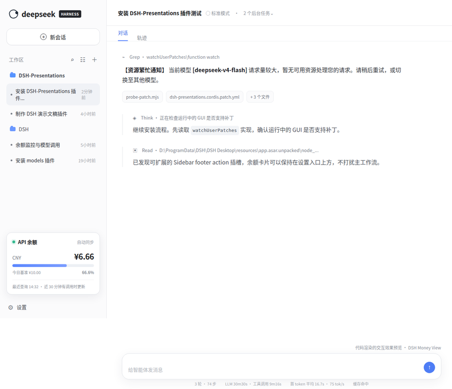
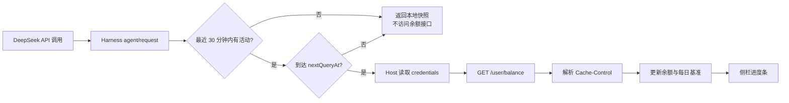

# DSH Money View

<p align="center">
  <strong>让 DeepSeek API 余额，像 Harness 的原生状态一样出现在你眼前。</strong>
</p>

<p align="center">
  <a href="https://github.com/tyche66/DSH-money-view/stargazers"></a>
  <a href="https://github.com/tyche66/DSH-money-view/blob/main/LICENSE"></a>
  <a href="https://github.com/deepseek-ai/deepseek-harness"></a>
  <a href="https://github.com/tyche66/DSH-money-view/issues"></a>
  <a href="https://github.com/tyche66/DSH-money-view/releases/tag/v0.1.0"></a>
</p>

<p align="center">
  <em>DeepSeek Harness 社区插件 · API 余额可视化 · TypeScript · React · Cordis</em>
</p>

> **一句话介绍：** DSH Money View 是一个面向 [DeepSeek Harness](https://github.com/deepseek-ai/deepseek-harness) 的社区插件，在左侧栏底部实时展示 DeepSeek API 余额，并用“当日首次查询余额”作为基准绘制剩余进度条。当前社区预览版本为 [`v0.1.0`](https://github.com/tyche66/DSH-money-view/releases/tag/v0.1.0)，安装前请先查看 [安装指南](docs/installation.md)。

## 为什么需要它？

当模型调用越来越频繁，余额往往不是“不重要”，而是太容易被忽略。DSH Money View 把余额状态放回 Harness 的工作流中：不打开控制台，不切换网页，不复制 API Key，也不需要手动刷新页面。你只需要看一眼左侧栏，就能知道余额是否正在下降、最近一次查询是什么时候，以及插件是否正在等待新的调用活动。

它不是一个粗暴的“每分钟打一次余额接口”的小组件，而是一个更克制的 Harness 原生扩展：**有调用才关注、按官方响应缓存节奏更新、每日建立一次基准、密钥永不进入浏览器端。**

## 界面预览

下面这张图不是手绘示意，而是由仓库中的 `assets/preview.html` 使用 HTML/CSS 代码渲染，再通过浏览器截取的完整产品效果图。它把余额卡片放回 Harness 的真实工作流上下文：左侧是工作区和会话列表，底部是 API 余额卡片，右侧是对话与工具调用区域。

<p align="center">
  
</p>

> 预览中的 `¥6.66`、`¥10.00` 和 `66.6%` 是演示数据；布局、间距、进度条和卡片位置来自可复现的 HTML/CSS 渲染。你可以直接打开 [`assets/preview.html`](assets/preview.html) 查看或修改效果图源文件。

## 核心体验

| 能力 | 行为 |
|---|---|
| 左侧栏原生位置 | 使用 Harness 的 `sidebar.footer.action` 插槽，显示在 Settings 上方。 |
| 智能查询触发 | 只有最近 30 分钟内发生过 DeepSeek API 调用时，才会触发外部余额查询。 |
| 官方节奏优先 | 优先读取余额响应中的 `Cache-Control: max-age`；未提供时默认回退为 5 分钟。 |
| 每日进度基准 | 每个自然日第一次成功查询的 `total_balance` 作为当日总额基准。 |
| 多币种安全展示 | CNY 与 USD 分开计算、分开显示，不进行未经授权的汇率换算。 |
| 密钥不进前端 | Host 侧通过 Harness credentials service 解析 API Key，浏览器只拿到余额快照。 |
| 手动即时检查 | 点击余额卡片即可发起一次状态检查，同时仍遵循服务端新鲜度和活动窗口。 |

## 查询逻辑



DeepSeek 官方余额接口公开了 `balance_infos` 及其中的 `currency`、`total_balance`、`granted_balance` 和 `topped_up_balance` 字段；本插件使用 `total_balance` 作为显示余额与进度计算依据。[1]

> 官方文档目前定义了接口和响应字段，但没有在页面上承诺固定的余额刷新周期。因此插件采用“**响应缓存提示优先，5 分钟保守回退**”的策略，而不是把 5 分钟误称为官方硬性保证。[1]

## 安装方式

> **第一次安装？** 请先阅读完整的 [安装指南](docs/installation.md)。下面的内容适合已经熟悉 Harness workspace 和 Cordis composition 的开发者。

### 方式一：作为 Harness workspace extension 使用

将本仓库中的 `packages/extensions/deepseek-balance` 复制到 DeepSeek Harness 的 `packages/extensions/` 下，并在默认 Web bundle 的依赖与 Cordis composition 中加入以下包名。完整命令和配置片段请查看 [docs/installation.md](docs/installation.md)：

```text
@deepseek-ai/dsh-deepseek-balance
```

随后重新构建 Harness。插件会通过 `sidebar.footer.action` 注册侧栏卡片，并使用已有的 `credentials`、`connection` 和 `ui-sidebar` 能力。

### 方式二：接入自定义 Cordis composition

在你的插件清单中加入余额 Host/client 双面插件，并确保它与以下能力同时启用：

```yaml
- package: '@deepseek-ai/dsh-deepseek-balance'
  enabled: true
```

如果你使用的是从源码构建的 Harness，请确保 TypeScript project references 同时包含 Host 与 Client 两侧入口。

## 配置项

| 配置项 | 默认值 | 说明 |
|---|---:|---|
| `baseURL` | `https://api.deepseek.com` | DeepSeek-compatible API origin。 |
| `apiKeyEnv` | `DEEPSEEK_API_KEY` | Harness credential reference，不是明文密钥。 |
| `defaultRefreshIntervalMs` | `300000` | 未返回 `Cache-Control: max-age` 时的 5 分钟回退。 |
| `activityWindowMs` | `1800000` | 近 30 分钟调用活动窗口。 |

插件不会把 API Key 写入 Local Storage、UI 状态或浏览器 bundle。请继续按照 Harness 的凭据管理方式配置 `DEEPSEEK_API_KEY`。

## 项目结构

```text
packages/extensions/deepseek-balance/
├── src/index.ts                    # Host：余额查询、活动窗口、每日基准、RPC
├── src/client/index.ts             # Client：注册 sidebar footer action
├── src/client/BalanceCard.tsx      # Client：余额卡片与轮询调度
├── src/client/BalanceCard.module.css# Client：Harness 风格样式
├── package.json                    # DSH plugin metadata 与依赖
├── tsconfig.json
└── tsdown.config.ts
```

## 开发与验证

在完整的 DeepSeek Harness workspace 中，可以使用以下命令构建插件：

```bash
pnpm --filter @deepseek-ai/dsh-deepseek-balance bundle
```

本仓库还保留了 Host 侧 smoke test，用于验证 5 分钟新鲜度、30 分钟活动窗口、每日基准重置和进度比例：

```bash
node scripts/test-deepseek-balance-smoke.mjs
```

由于该插件依赖 Harness workspace 内部包，它不是一个脱离 Harness 即可独立运行的浏览器扩展；它的目标是成为可审阅、可维护、可合并到 Harness 生态中的社区插件。

## 设计原则

DSH Money View 只做一件事：把余额状态放到最靠近调用决策的位置。它不改写模型调用，不代理用户请求，不保存账单历史，也不尝试把不同货币粗略相加。查询节奏尽量尊重服务端缓存，余额基准固定在当天首次成功查询，所有影响安全和准确性的逻辑都留在 Host 侧。

如果你希望继续扩展，欢迎提交 Issue 或 Pull Request。适合的后续方向包括：低余额阈值提醒、余额变化趋势、按模型的消耗估算、暗色主题细化以及更多 Harness provider 的余额适配。

## 参与社区

本项目定位为 **DeepSeek Harness Plugin Community** 的社区插件，欢迎围绕以下主题协作：

- Harness sidebar 与 UI Slots 扩展
- DeepSeek provider 的安全运维工具
- Cordis Host/client 双面插件
- 不打扰主流程的实时状态展示

提交 PR 前，请尽量保持 Host/client 边界清晰，并补充至少一个可重复验证的测试场景。

## 许可证

本项目采用 [MIT License](LICENSE)。DeepSeek Harness 与 DeepSeek API 的使用仍需遵守其各自的项目、服务和接口条款。

## References

[1]: https://api-docs.deepseek.com/zh-cn/api/get-user-balance/ "DeepSeek API 文档：查询余额"
[2]: https://github.com/deepseek-ai/deepseek-harness "DeepSeek Harness GitHub Repository"
